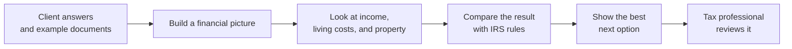
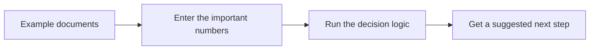
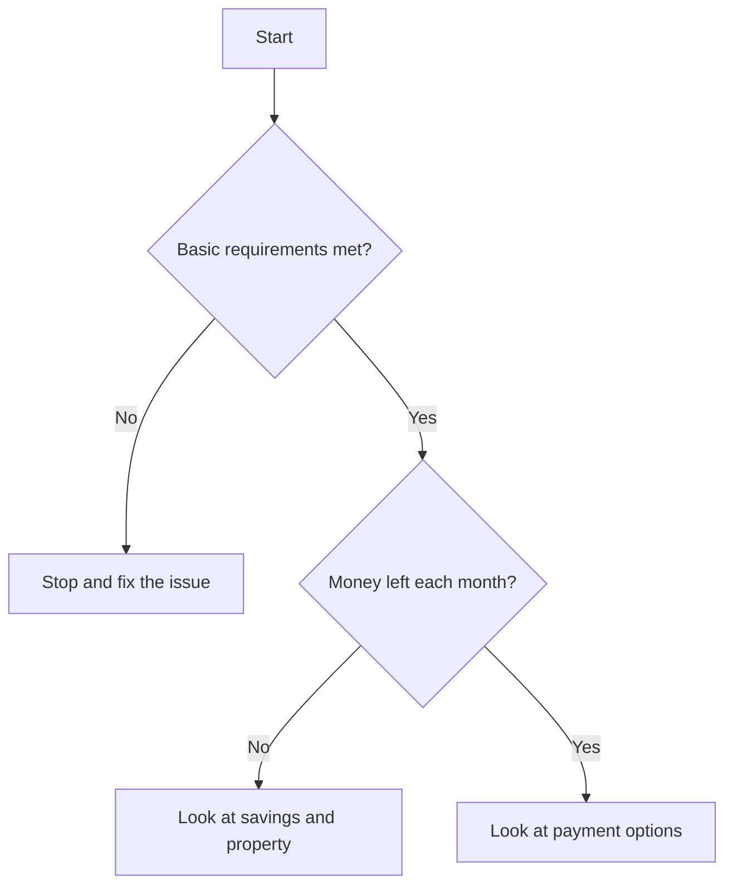
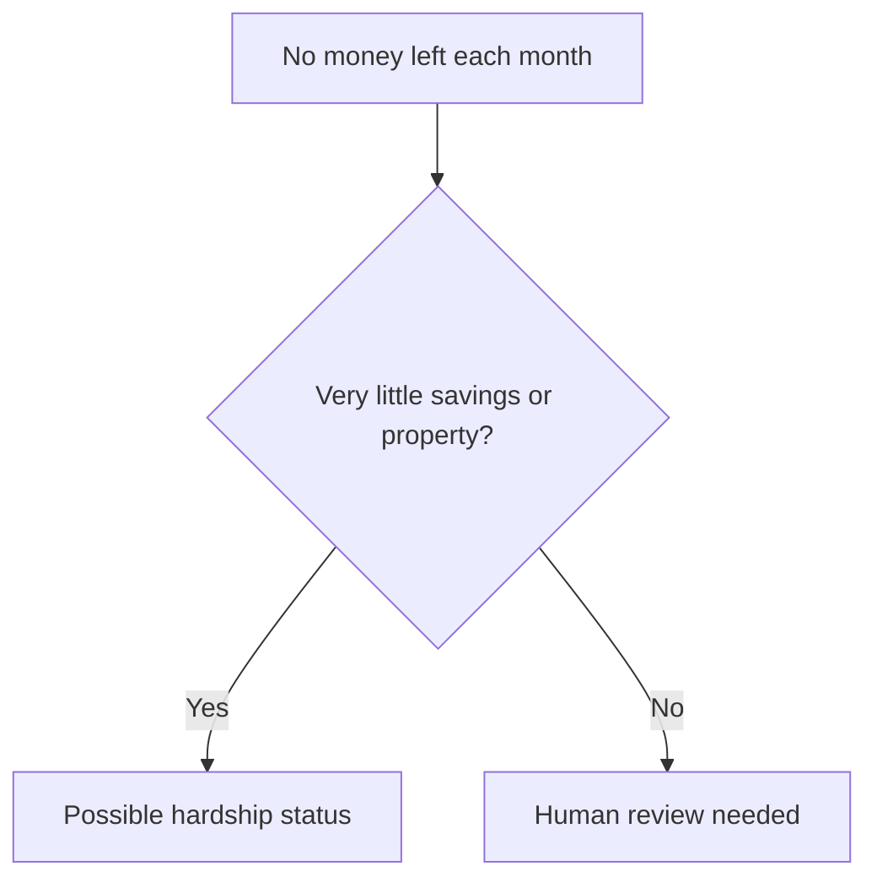
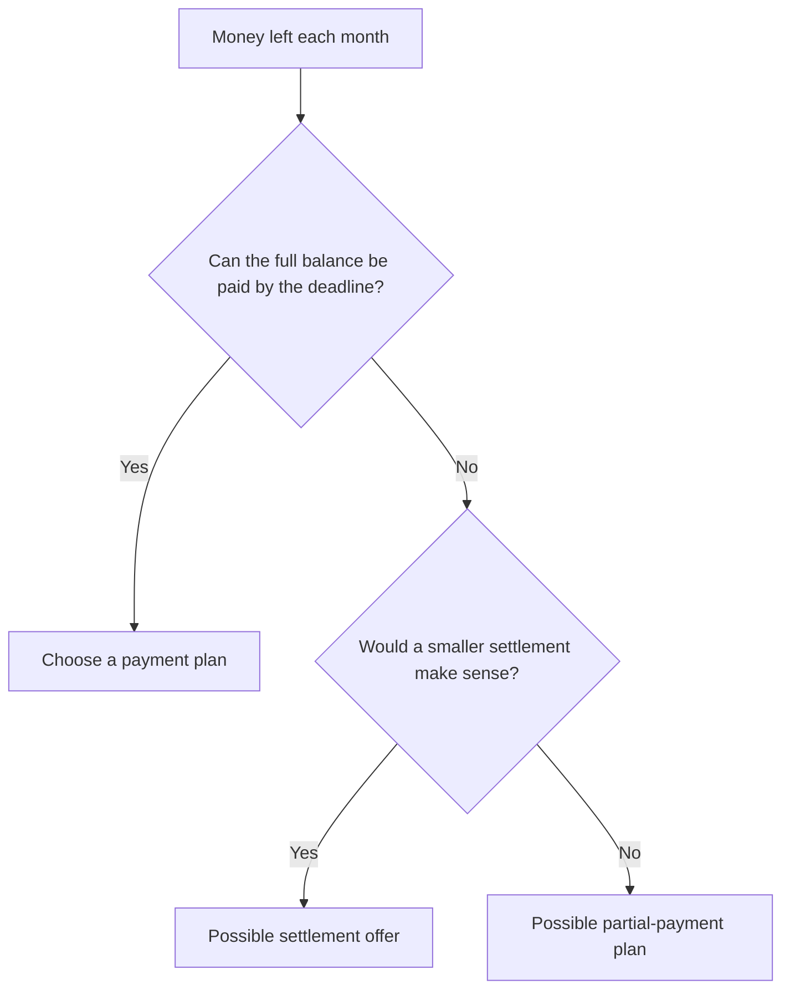
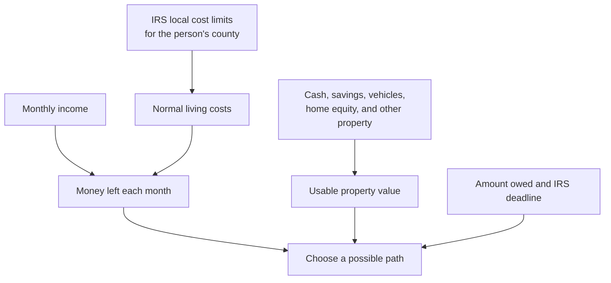

<!-- generated-by: gsd-doc-writer -->
# ResSpark

ResSpark helps a tax professional quickly see which IRS payment or settlement option may fit a person's financial situation.

> It is a screening tool, not a final filing decision. A tax professional should always review the documents and confirm the numbers before anything is sent to the IRS.

## The big picture



The tool looks at how much money comes in each month, what the person needs to live on, what property or savings they have, how much they owe, and how much time the IRS has left to collect.

## Example documents

The [`Examples/`](Examples/) folder has three made-up client packets. They include things like tax transcripts, bank statements, pay stubs, housing records, and insurance or vehicle documents.

```text
Examples/
├── 01_marcus_delgado_CNC/              # A hardship case
├── 02_whitfield_gregory_OIC/           # A settlement-offer case
└── 03_renata_alves_streamlined_IA/     # A payment-plan case
```

The current program does not read those PDFs on its own. They are examples of the information that would be entered into the program.



## How it chooses a next step



If there is no money left each month, the tool uses this smaller check:



If there is money left each month, it uses this payment check:



## What the tool counts



The program uses the person's actual county for housing costs and the right local transportation area. It also gives the allowed vehicle reductions before counting vehicle value.

## Possible results

| Result | Simple meaning |
|---|---|
| Stop and fix the issue | Something basic is missing, such as an unfiled return or an open bankruptcy case. |
| Hardship status | There is no money left each month and very little usable property. |
| Payment plan | The person can pay the full balance before the IRS collection deadline. |
| Settlement offer | The person's available property and future ability to pay appear lower than the full balance. |
| Partial-payment plan | The person can pay something each month, but not enough to pay the full balance before the deadline. |
| Human review | The numbers point in more than one direction and a professional needs to decide. |

## A few helpful terms

- **IRS collection deadline:** the last date the IRS can generally collect the debt.
- **Settlement offer:** an Offer in Compromise, where the IRS may accept less than the full balance.
- **Partial-payment plan:** a monthly plan used when the full balance will not be paid before the collection deadline.

## Project layout

```text
ResSpark/
├── Examples/       # Made-up document packets
├── Context/        # IRS forms and standards used for reference
├── THIS ONE/       # Original version of the simple logic
└── THIS ONE V2/    # Updated version with current county, payment, and offer rules
```

The updated logic lives in `THIS ONE V2`:

- `financial_data.py` holds the client information.
- `questions.py` lists the simple intake questions.
- `standards.py` holds the county and transportation cost lookups.
- `determination.py` does the math and picks a suggested path.
- `demo.py` runs sample cases.

## Run the demo

```bash
cd "THIS ONE V2"
python demo.py
```

The demo prints the monthly income, allowed costs, usable property value, and suggested next step for three sample cases.
