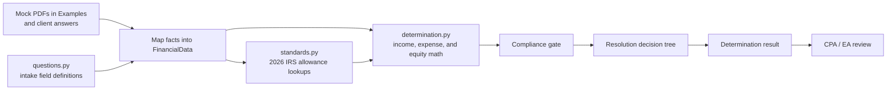
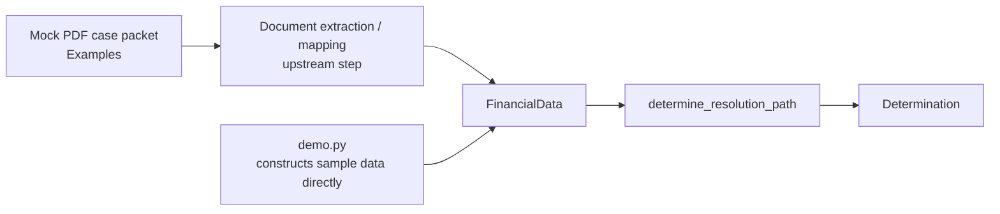
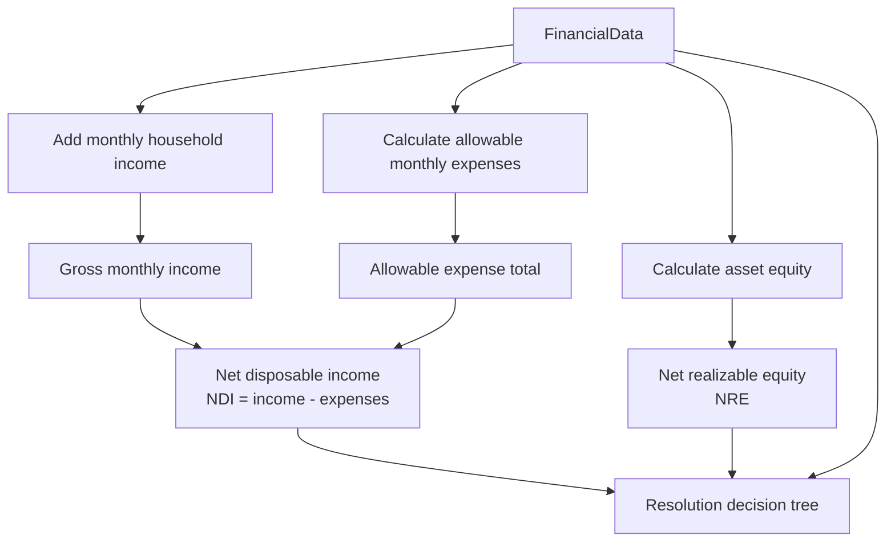
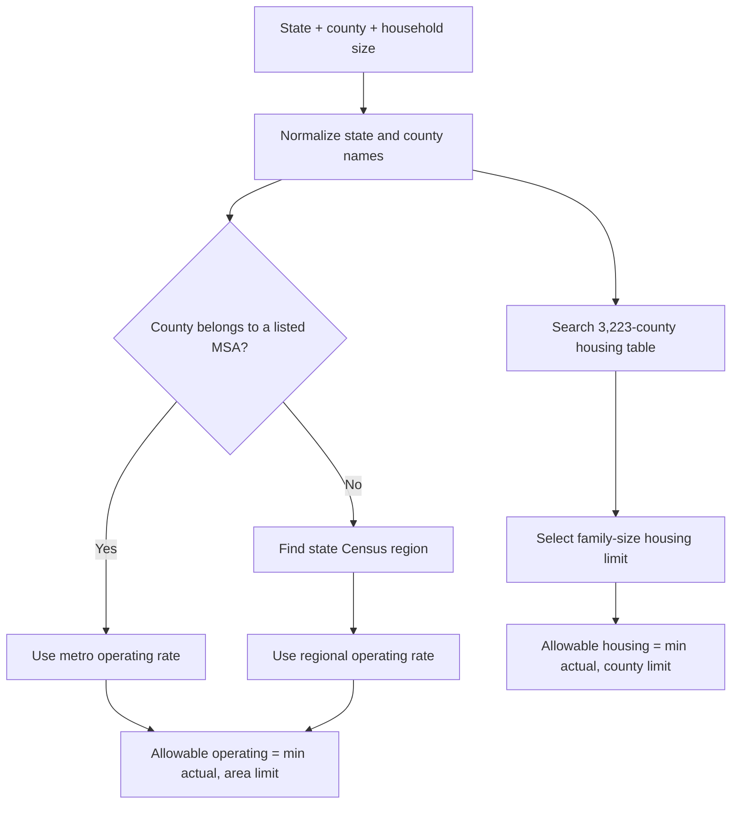
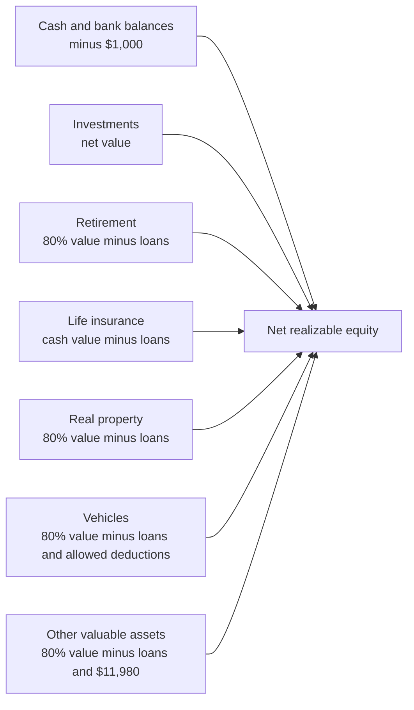
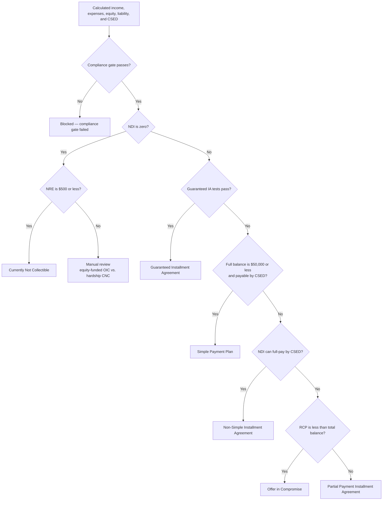
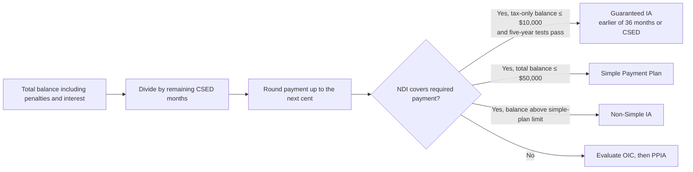
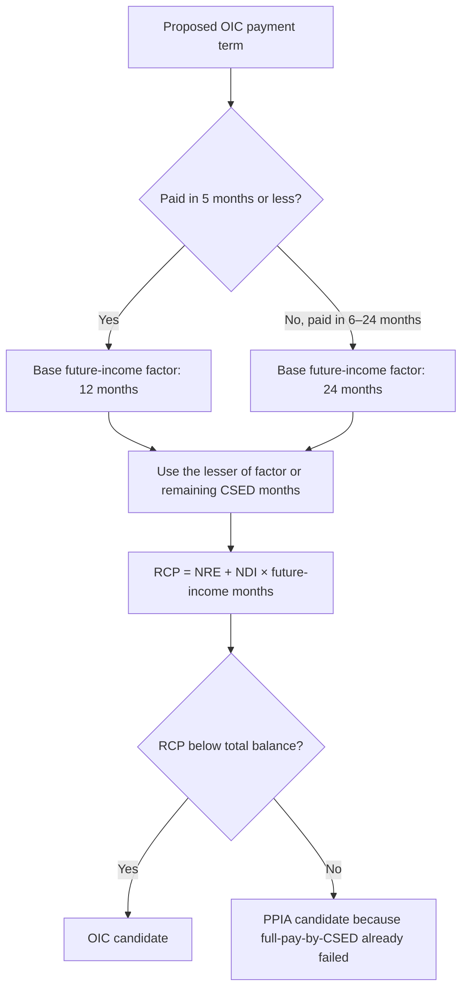

<!-- generated-by: gsd-doc-writer -->
# Tax Resolution Screening Logic — V2

This small Python project turns structured taxpayer financial data into a reviewable IRS resolution-path recommendation.

> This is a screening tool, not a filing decision. A CPA, enrolled agent, or tax attorney should verify transcripts, supporting documents, CSEDs, and current IRS guidance before anything is submitted.

## System flow



`FinancialData` is the single input model. The result is a `Determination` containing the recommended path, explanation, monthly income, allowable expenses, net disposable income, net realizable equity, suggested payment or offer, and any manual-review notes.

## Mock example data

The [`Examples/`](Examples/) folder contains synthetic PDF document packets for three representative tax-resolution cases:

```text
Examples/
├── 01_marcus_delgado_CNC/              # CNC scenario
├── 02_whitfield_gregory_OIC/             # Offer in Compromise scenario
└── 03_renata_alves_streamlined_IA/      # Installment-agreement scenario (legacy folder name)
```

Across the packets, the mock source documents include IRS account and wage transcripts, three months of bank statements, pay stubs, housing documents, auto-loan statements, health-insurance statements, and case-specific support such as a daycare invoice.



V2 does not currently parse the PDFs automatically; the example packets show the type of evidence that an extraction layer would map into `FinancialData`, while `demo.py` bypasses extraction and builds sample records directly in Python.

## Calculation pipeline



### Allowable expenses

| Category | V2 treatment |
|---|---|
| Food, clothing, and miscellaneous | Full national standard by household size |
| Housing and utilities | Lesser of actual expense or the taxpayer's county standard |
| Vehicle ownership | Lesser of actual loan/lease cost or the national ownership standard |
| Vehicle operating | Lesser of actual cost or the applicable metro/Census-region standard |
| Public transportation | Actual cost when the taxpayer has no vehicle |
| Out-of-pocket health care | Standard amount per household member, based on age |
| Health insurance, taxes, dependent care, and other listed expenses | Actual reported amount |

## County and transportation lookup

The included standards are effective June 29, 2026. Housing uses the taxpayer's actual county; transportation uses a listed metropolitan area when one applies and otherwise uses the taxpayer's Census region.



There is no national-median housing fallback and no hard-coded South-region fallback. An unknown county or state raises an error so the missing location can be corrected.

## Asset equity calculation



Vehicle equity is calculated vehicle by vehicle when individual values and loans are supplied:

- The first vehicle receives the $3,450 deduction.
- The second vehicle receives the $3,450 deduction only for a joint offer.
- Additional vehicles receive no vehicle deduction.
- The legacy aggregate vehicle totals remain supported for existing callers.

## Compliance gate

The decision tree stops for manual correction or review when any of these conditions apply:

- Required tax returns are not filed.
- The taxpayer is in an open bankruptcy proceeding.
- Unexplained deposits average at least $200 per month.

## Resolution decision tree



### Installment agreement rules



A Guaranteed Installment Agreement additionally requires an income-tax-only liability, a tax balance of $10,000 or less excluding penalties and interest, compliant filing/payment history for the preceding five tax years, and no income-tax installment agreement during that period.

### Offer in Compromise math



## Project files

```text
Tax Proplem/
├── Examples/                      # Mock PDF case packets used as sample source evidence
└── THIS ONE V2/
    ├── README.md                  # This overview
    ├── financial_data.py          # Shared taxpayer input model
    ├── questions.py               # Client-facing intake field definitions
    ├── standards.py               # 2026 national, county, and transportation lookups
    ├── determination.py           # Calculations, compliance gate, and decision tree
    ├── demo.py                    # Three runnable in-code sample cases
    ├── data/
    │   ├── housing_utilities_by_county.csv
    │   ├── msa_counties.csv
    │   └── state_regions.csv
    └── irs_mvp_v2.zip             # Packaged source archive
```

## Run the demonstration

The project uses only Python's standard library and the local CSV data files.

```bash
cd "THIS ONE V2"
python demo.py
```

The demo prints each case's income, allowable-expense breakdown, disposable income, realizable equity, recommended resolution path, reason, and suggested payment or offer.

## Primary entry points

```python
from financial_data import FinancialData
from determination import determine_resolution_path

case = FinancialData(
    state_of_residence="TX",
    county_of_residence="Harris County",
    household_size=1,
    gross_wages_taxpayer=4_000,
    total_tax_owed=30_000,
    csed_months_remaining=72,
)

result = determine_resolution_path(case)
print(result.path)
print(result.suggested_offer_or_payment)
```

For local testing or review, the individual calculation functions in `determination.py` can also be called directly before running the complete decision tree.

## IRS references represented in the logic

- Form 433-A (OIC), Rev. 4-2026
- IRS Collection Financial Standards, effective June 29, 2026
- IRM 5.14.5.2, Simple Payment Plans
- IRM 5.14.5.3, Guaranteed Installment Agreements
- IRM 5.14.1.4, installment-agreement analysis
- IRM 5.8.5.25, calculation of OIC future income
