# Taxpayer question flow

```mermaid
flowchart TD
    A{Are you married?}

    A -->|Yes| B[Are you filing jointly<br/>with your spouse?]
    A -->|No| C[What state do you live in?]
    B --> C

    C --> D[What county do you live in?]
    D --> E[How many people live in your household?]
    E --> F[How many dependents do you claim?]
    F --> G[What is your age?]

    G --> H{Are you married?}
    H -->|Yes| I[What is your spouse's age?]
    H -->|No| J{Do you own your home?}
    I --> J

    J -->|No| K[Do you rent your home?]
    J -->|Yes| L{Do you receive a W-2 paycheck?}
    K --> L

    L -->|Yes| M[How often are you paid?]
    L -->|No| N{Are you self-employed?}
    M --> N

    N --> O[How many vehicles do you own or lease?]
    O --> P{Do you own other real estate?}
    P --> Q{Do you have retirement accounts?}
    Q --> R{Do you have life insurance<br/>with cash value?}
    R --> S{Do you have investment accounts?}

    S --> T{Have you filed all required tax returns?}
    T --> U{Are you in an open bankruptcy?}
    U --> V{Have you filed bankruptcy<br/>in the past 7 years?}
    V --> W{Are you currently in litigation?}
    W --> X{Have you defaulted on a prior IRS<br/>payment plan or offer?}
    X --> Y{For the last 5 tax years, did you<br/>file and pay on time?}
    Y --> Z{Have you had an income-tax installment<br/>agreement in the past 5 years?}
```

## Removed and backend-only fields

The following fields are removed from the taxpayer flow and the canonical data
model:

- `income_tax_only`
- `transferred_asset_10k_10yrs`
- `has_unexplained_deposits`
- `unexplained_deposits_monthly`

`oic_payment_months` remains in canonical case data but is not a question. A
future backend OIC process will populate it after the taxpayer intake ends.
